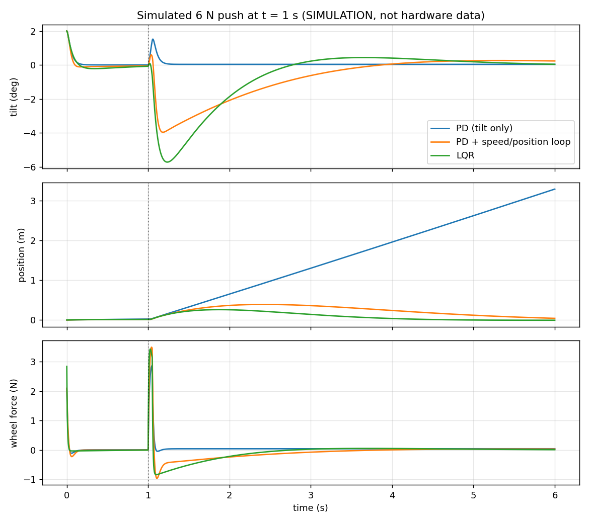

# Self-Balancing Robot

A two-wheeled inverted-pendulum robot that stays upright using **IMU feedback and a cascaded PID controller**,
with encoder-based speed/position hold, live tuning over serial, a physics simulation, and logging tools.

<!--
BEFORE PUBLISHING - search this file for "TODO" and replace every placeholder with YOUR real
parts, numbers, photos and video. Delete anything you did not actually build or measure.
-->

> **Demo:** TODO add a photo / GIF / video link of your robot balancing.

## What this project covers

| Stage | What was done | Where |
|-------|---------------|-------|
| 1. Modelling | Cart-pole equations of motion, linearisation, open-loop poles | [`docs/01_physics_model.md`](docs/01_physics_model.md), [`simulation/`](simulation) |
| 2. Hardware | Chassis, motors with encoders, MPU6050, TB6612FNG, 2S LiPo | [`docs/02_hardware_and_wiring.md`](docs/02_hardware_and_wiring.md), [`hardware/`](hardware) |
| 3. Sensing | Gyro calibration, complementary filter (accelerometer + gyro) | [`docs/03_imu_filtering.md`](docs/03_imu_filtering.md), `firmware/.../imu.h` |
| 4. Control | Inner PID on tilt (gyro-based D term), outer PI on wheel speed | [`docs/04_pid_tuning_guide.md`](docs/04_pid_tuning_guide.md) |
| 5. Test and tuning | Step-by-step bring-up, live gain tuning, EEPROM storage | [`docs/05_bringup_and_testing.md`](docs/05_bringup_and_testing.md) |
| 6. Validation | Logged experiments and plots | [`data/`](data), [`tools/`](tools) |

## How it works

```
speed target ─► [speed PI] ─► angle offset ─┐
                                            ▼
balance trim ───────────────────────────► (+) ─► angle target
                                                    │
MPU6050 ─► complementary filter ─► tilt ────────► (−) ─► error ─► [PID, D from gyro] ─► TB6612FNG ─► motors
                                                                                              │
                                                              encoders ─► wheel speed ────────┘ (outer loop)
```

* The robot is an **unstable inverted pendulum**: a tilt grows by itself, so the wheels must be driven
  under the centre of mass faster than it falls. The control loop runs at **200 Hz**.
* **Sensing:** the accelerometer gives a drift-free but noisy angle, the gyro a smooth but drifting one. A complementary
  filter (α = 0.99) combines them.
* **Control:** an inner PID loop on tilt keeps the robot upright. A slower outer loop uses wheel speed to
  shift the angle target slightly, because holding position requires leaning *backward* to brake.
* **Safety:** motors start disabled, cut out beyond ±35° tilt, re-arm only when held upright, and the test
  commands time out on their own.

## Simulation

`simulation/pendulum_sim.py` simulates the same robot structure with three controllers and a 6 N push.



*This figure is **simulation output** with example parameters, not measured hardware data.* It shows why the outer loop
exists: with tilt-only PD (blue) the robot stays upright but drifts away at constant speed, while the cascade
(orange) and LQR (green) bring it back to its starting position.

## Hardware results

TODO — fill this in from your own runs (`tools/plot_log.py` prints these numbers). Remove rows you did not measure.

| Metric | Result |
|--------|--------|
| Balance time (flat floor) | TODO |
| RMS tilt while balancing | TODO deg |
| Largest push recovered | TODO |
| Drift over 30 s, outer loop off / on | TODO m / TODO m |
| Final gains (kp / ki / kd / trim) | TODO |
| Loop rate | 200 Hz (set by `LOOP_US`) |

TODO — add a tilt/rate/PWM plot from `data/runs/` and a short video.

## Repository layout

```
self-balancing-robot/
├── docs/          theory, hardware notes, filtering, tuning guide, bring-up procedure, references
├── hardware/      bill of materials, wiring tables
├── firmware/      Arduino sketch (balance_robot/) with config, IMU, motors, encoders
├── simulation/    Python cart-pole model: PD vs cascade vs LQR
├── tools/         log_serial.py (talk + record), plot_log.py (plots + summary numbers)
├── data/          your tuning log, experiment log, raw runs
└── README.md
```

## Quick start

1. **Build** the robot: parts in [`hardware/BOM.md`](hardware/BOM.md), wiring in [`hardware/wiring.md`](hardware/wiring.md).
2. **Upload** `firmware/balance_robot/balance_robot.ino` with the Arduino IDE (Uno or Nano).
3. Open the serial monitor (115200 baud, Newline) and follow the bring-up in
   [`docs/05_bringup_and_testing.md`](docs/05_bringup_and_testing.md): `mode imu` → `mode enc` → `mode motor` → `mode balance`.
4. **Tune** with live commands (`kp 20`, `kd 0.8`, `trim 1.2`, `outer 1`, `save`), following
   [`docs/04_pid_tuning_guide.md`](docs/04_pid_tuning_guide.md).
5. **Log** and plot:
   ```bash
   pip install -r simulation/requirements.txt
   python tools/log_serial.py --port /dev/ttyUSB0 --out data/runs/run_001.csv   # COM5 on Windows
   python tools/plot_log.py data/runs/run_001.csv
   ```
6. **Simulate** (no hardware needed):
   ```bash
   cd simulation && python pendulum_sim.py
   ```

The default gains in the firmware are generic starting points. Every robot needs its own gains.

## Build progress checklist

Tick these as you really complete them.

- [ ] IMU verified (angle signs, calibration, filter plot)
- [ ] Encoders verified (direction, counts per revolution)
- [ ] Motors verified (direction, dead-band measured)
- [ ] Sign check passed (tilt forward → wheels forward)
- [ ] Balances with inner loop only
- [ ] Trim found, gains saved
- [ ] Outer speed loop working
- [ ] Remote drive (`speed`, `turn`) working
- [ ] Validation experiments logged in `data/`
- [ ] Photo / video added to this README

## Challenges and lessons

TODO — write what actually went wrong and how you fixed it (e.g. motor noise on the IMU, dead-band, oscillation
from too much Kd, battery sag). This section is what makes the project yours.

## Future work

- LQR on hardware using the model in `simulation/`
- Bluetooth / WiFi remote on an ESP32 port
- Obstacle avoidance and a line-following mode
- Kalman filter comparison against the complementary filter

## References

See [`docs/references.md`](docs/references.md).

## Acknowledgements

Starter firmware, documentation and simulation were drafted with AI assistance (Claude, by Anthropic); the hardware build,
testing, tuning and results are my own. **TODO: edit this line so it is accurate for you.**

## License

MIT, see [`LICENSE`](LICENSE).
